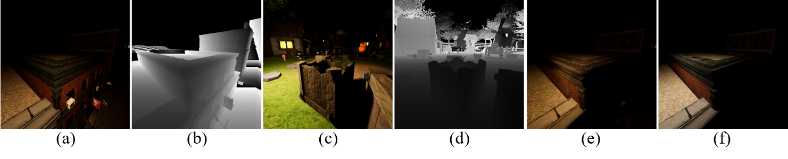

# S3Net: A Single Stream Structure for Depth Guided Image Relighting
NTIRE 2021 Depth Guided Relighting Challenge Track 2: Any-to-any relighting (CVPR Workshop 2021)  *3rd* Solution.

Any-to-any relighting aims to relight an input image with a certain color temperature and light source position setting to match the illumination setting of another guided image. Furthermore, the depth maps of two images are given. The example images are plotted. (a) and (c): Original image and deepth map. (b) and (d): Guided image and depth map. (e): Relit image. (f) Ground truth.

<p align="center"></p>

We will provide the codes and pre-train models (coming soon !!!)

[Report paper](https://openaccess.thecvf.com/content/CVPR2021W/NTIRE/papers/Helou_NTIRE_2021_Depth_Guided_Image_Relighting_Challenge_CVPRW_2021_paper.pdf),[S3Net paper](https://openaccess.thecvf.com/content/CVPR2021W/NTIRE/papers/Yang_S3Net_A_Single_Stream_Structure_for_Depth_Guided_Image_Relighting_CVPRW_2021_paper.pdf) [CVPRW2021, Accepted]

### Relit Images

[Here](https://github.com/majedelhelou/VIDIT) is the original images from VIDIT dataset

We also provide the relit images by our S3Net: [val](https://drive.google.com/file/d/1IpsXRMY4xTjYyAUJLEQI-UFQQf0HvLl7/view?usp=sharing) and [test](https://reurl.cc/GdaGky).

### Another solution (*1st* Solution, NTIRE 2021 Depth Guided Relighting Challenge Track 1: One-to-one relighting) of our team: 

https://github.com/weitingchen83/NTIRE2021-Depth-Guided-Image-Relighting-MBNet

# Citations
Please cite this paper in your publications if it is helpful for your tasks:    

Bibtex:
```
@inproceedings{yang2021S3Net,
    title     = {{S3N}et: A Single Stream Structure for Depth Guided Image Relighting},
    author    = {Yang, Hao-Hsiang and Chen, Wei-Ting and Kuo, Sy-Yen},
    booktitle = {Proceedings of the IEEE Conference on Computer Vision and Pattern Recognition Workshops (CVPRW)},
    year      = {2021}
}
```
